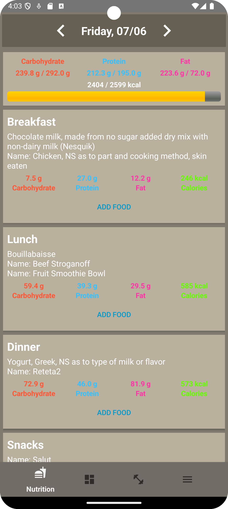
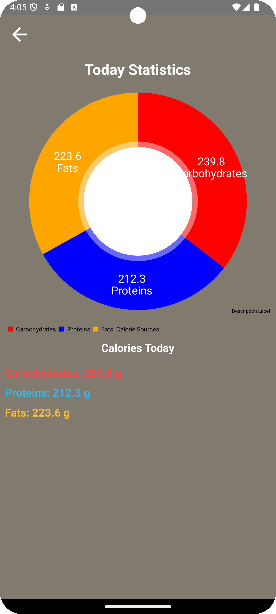
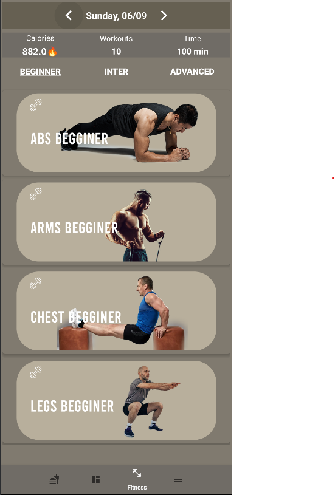
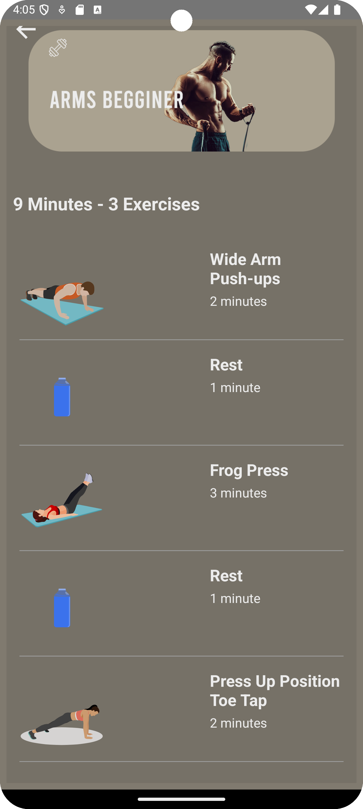
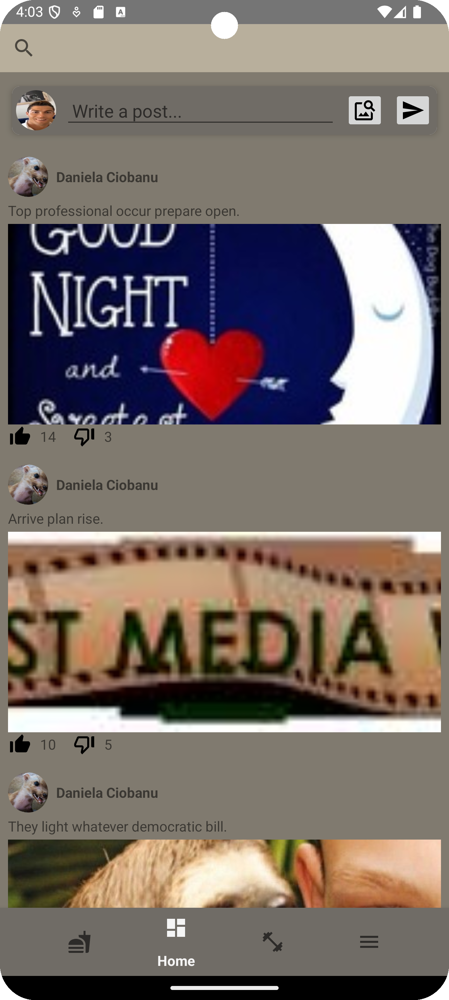
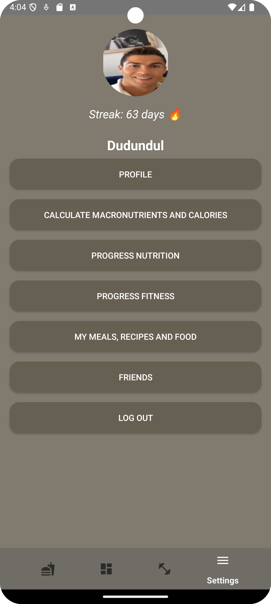

# WellFlex

Designed for Android, the app was developed in Java and utilizes Firebase for database management and backend services. 
This is my bachelor's thesis project.

## Login Screen
This is the login screen where users can sign in to their account or create a new one.

  

## Nutrition and Statistics Screens
The nutrition screen helps users keep track of their dietary intake, while the statistics screen provides insights and analytics on their nutrition progress.

  
  

## Workout Screens
These screens showcase different workout routines and exercises that users can follow.

  
  

## Social Screen
The social screen allows users to connect with friends, share their progress, and engage with the community.

  

## Options Screen
The options screen allows users to modify their profile, calories and macros, modify their friends list and see progress charts about their nutrition and fitness progress

  

