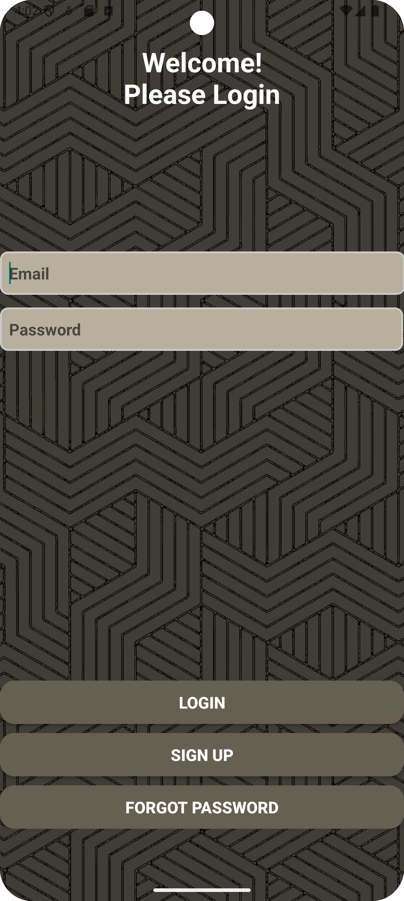

# My Nutrition Fitness and Social App

## Login Screen

This is the login screen where users can sign in to their account or create a new one.

## Options Screen

The options screen allows users to navigate through different sections of the app such as workouts, nutrition, and social features.

## Nutrition and Statistics Screens

  
  

The nutrition screen helps users keep track of their dietary intake, while the statistics screen provides insights and analytics on their fitness progress.

## Workout Screens

  
  

These screens showcase different workout routines and exercises that users can follow.

## Social Screen

The social screen allows users to connect with friends, share their progress, and engage with the community.
